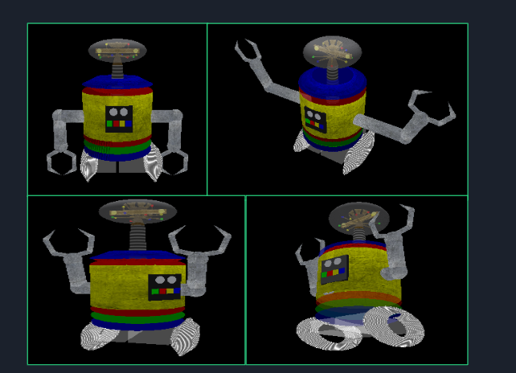

# Instruções de Uso do Projeto Final - Computação Gráfica no OpenGL

## Introdução
Este projeto foi desenvolvido para a disciplina de Computação Gráfica e permite controlar um robô utilizando teclas específicas e o mouse.

## Controles do Robô

### Movimentação da Cabeça
- **Girar para a esquerda:** `u`
- **Girar para a direita:** `i`
- **Levantar a cabeça:** `p`
- **Abaixar a cabeça:** `o`

### Movimentação do Corpo
- **Rotacionar somente o corpo do robô:** `z`

### Controles do Braço
- **Aumentar o tamanho do braço:** `1`
- **Diminuir o tamanho do braço:** `2`
- **Abrir o braço:** `4`
- **Fechar o braço:** `3`

### Controles da Garra
- **Abrir a garra:** `5`
- **Fechar a garra:** `6`

## Controles da Câmera

### Zoom
- **Tirar zoom:** Scroll do mouse para baixo
- **Dar zoom:** Scroll do mouse para cima

### Movimentação
- **Olhar para a direita:** `Seta Direita`
- **Olhar para a esquerda:** `Seta Esquerda`
- **Olhar para cima:** `Seta Cima`
- **Olhar para baixo:** `Seta Baixo`

### Rotação
- **Rotacionar para direita/esquerda:** Botão esquerdo do mouse + mover
- **Rotacionar para cima/baixo:** Botão direito do mouse + mover

## Movimentação do Robô
Para movimentar o robô, utilize a mecânica onde apenas o próprio robô consegue girar as rodas:
1. **Reduza o tamanho do braço ao mínimo:** pressione `2` repetidamente.
2. **Coloque o braço mais colado ao corpo:** pressione `3`.
3. **Mova o robô para frente:** pressione `w` (desde que esteja na angulação da roda).
4. **Mova o robô para trás:** pressione `s` (desde que esteja na angulação da roda).

## Tabela de Comandos

| Funcionalidade             | Ação                                 | Comando |
|----------------------------|--------------------------------------|---------|
| **Movimentação da Cabeça**   | Girar para a esquerda             | `u`     |
|                            | Girar para a direita              | `i`     |
|                            | Levantar a cabeça                | `p`     |
|                            | Abaixar a cabeça                 | `o`     |
| **Movimentação do Corpo**   | Rotacionar somente o corpo        | `z`     |
| **Controles do Braço**      | Aumentar o tamanho do braço       | `1`     |
|                            | Diminuir o tamanho do braço      | `2`     |
|                            | Abrir o braço                    | `4`     |
|                            | Fechar o braço                   | `3`     |
| **Controles da Garra**     | Abrir a garra                     | `5`     |
|                            | Fechar a garra                    | `6`     |
| **Controles da Câmera**    | Tirar zoom                        | Scroll para baixo |
|                            | Dar zoom                          | Scroll para cima  |
|                            | Olhar para a direita              | `Seta Direita`    |
|                            | Olhar para a esquerda             | `Seta Esquerda`   |
|                            | Olhar para cima                   | `Seta Cima`       |
|                            | Olhar para baixo                  | `Seta Baixo`      |
| **Rotação da Câmera**    | Rotacionar para direita/esquerda  | Botão esquerdo do mouse + mover |
|                            | Rotacionar para cima/baixo        | Botão direito do mouse + mover |
| **Movimentação do Robô**  | Reduzir o tamanho do braço ao mínimo | `2` (repetidamente) |
|                            | Colocar o braço mais colado ao corpo | `3` |
|                            | Mover o robô para frente         | `w`     |
|                            | Mover o robô para trás           | `s`     |

## Imagens do Robô
Aqui estão algumas imagens ilustrando o funcionamento do robô:



## Como Executar o Projeto
1. Clone este repositório:
   ```sh
   git clone https://github.com/seu-usuario/seu-repositorio.git
   ```
2. Acesse a pasta do projeto:
   ```sh
   cd seu-repositorio
   ```
3. Compile e execute o código seguindo as instruções fornecidas no projeto.

## Autores
- **Arthur Hernandez Perez**
- **Mariana Martins Chagas**

---
Este documento serve como um guia rápido para uso do software. Para mais informações, consulte a documentação completa no repositório.

